# Arquitetura e Pipelines

O **SciNewsAI** coleta artigos científicos semanais de bases públicas, usa RAG + LLM para gerar versões em linguagem acessível, transforma em podcast, armazena dados e alimenta website, redes sociais e notificações via n8n (LinkedIn, Twitter/X, WhatsApp, Telegram). Este documento detalha componentes, fluxo de dados, modelos, armazenamento, integrações, segurança, monitoramento e plano de implantação.

## Visão Geral da Arquitetura

A arquitetura será orientada a eventos e desacoplada, com o objetivo de promover a manutenção, escalabilidade e a substituição de componentes no futuro.

  
<strong>Figura 1:</strong> Diagrama da Arquitetura. <em>Fonte: Bruno Martins, 2025</em>

---

### **Módulo 1: Coleta de Dados**

> Agenda e executa a coleta de novos artigos científicos de fontes predefinidas.

**Processo:**

1. O orquestrador dispara um flow semanalmente.
2. O flow executa um script Python que:
    1. Consulta APIs e faz scraping para encontrar artigos publicados nos últimos 7 dias (arXiv, Google Scholar).
    2. Filtra os artigos por relevância (ex: palavras-chave, citações iniciais) para evitar sobrecarga.
    3. Para cada artigo selecionado, coleta metadados (título, autores, resumo, link para o PDF/página).
    4. Envia uma mensagem para uma fila (e.g. RabbitMQ, Redis) com os metadados de cada artigo a ser processado.

**Tecnologias utilizadas:**

- Bibliotecas `requests`e `feedparser` para scraping básico. `PyMuPDF (fitz)` para extrair textos dos PDFs.
- Prefect, para orquestração de workflows.

---

### **Módulo 2: Processamento e Enriquecimento (ML/AI Core)**

> Transforma o artigo científico bruto em um resumo acessível e um arquivo de áudio.

**Processo:**

1.  Um worker pega uma mensagem da fila contendo os metadados de um artigo.
2.  Extração: O worker baixa o PDF do artigo e extrai todo o seu texto.
3.  Chunking: O texto extraído é dividido em chunks menores e semanticamente coerentes.
4.  Embedding e Indexing: Cada chunk de texto é transformado em um vetor numérico e armazenado em um vector store.
5.  Simplificação via RAG:
    1. O worker formula um prompt para o LLM.
    2. Para encontrar o contexto, ele pega o resumo ou título do artigo, gera um embedding para essa query e busca os chunks mais similares no Vector Store.
    3. Os chunks recuperados são inseridos no prompt.
    4. O LLM gera o texto simplificado.
6.  Geração de Áudio: O texto simplificado é enviado para a API do Gemini, que retorna um arquivo de áudio (ex: MP3).

**Tecnologias utilizadas:**

- Framework de IA/ML: Python com LangChain para orquestrar o pipeline de RAG.
- Extração de Texto de PDF: `PyMuPDF` ou `pdfplumber`.
- Embeddings: Um modelo `sentence-transformers` (open-source).
- Vector Store (para RAG): ChromaDB ou PGVector.
-  LLM: Google Gemini.

---

### **Módulo 3: Armazenamento (Data Persistence)**

> Seu objetivo é armazenar de forma eficiente e segura os dados brutos, os resultados processados e os arquivos de mídia.

**Tecnologias utilizadas:**

- SGBD: PostgreSQL com PGVector.
- Object Storage: AWS S3, Google Cloud Storage, Cloudflare R2 (a decidir).

  
<strong>Figura 2:</strong> Tabela SQL de Artigos. <em>Fonte: Gustavo Melo, 2025</em>

---

### **Módulo 4: Apresentação (Frontend & API)**

> Expõe os artigos processados para a web através de um blog.

**Processo:**

1.  O Backend expõe endpoints.
2.  O Frontend consome esses endpoints para renderizar as páginas do blog.
3.  Cada página de artigo exibirá o título, o texto simplificado e um player de áudio embutido.

**Tecnologias utilizadas:**

- Backend: FastAPI.
- Frontend: React/Next.js

---

### **Módulo 5: Distribuição e Notificação (Automação)**

> Divulga o conteúdo e notifica usuários interessados.

**Workflow de Divulgação em Redes Sociais (Agendado):**

1. Agendado para rodar algumas vezes por dia (ex: a cada 4 horas).
2. Faz uma chamada HTTP para a API FastAPI.
3. Pega um dos artigos da lista.
4. Usa os nós (nodes) do n8n para Twitter e LinkedIn para formatar e postar uma mensagem com o título do artigo e um link para a página do blog.

**Workflow de Notificações para Usuários (Orientado a Eventos):**

1.  A API envia uma requisição para uma URL de webhook do n8n.
2.  O workflow recebe o ID do artigo.
3.  Faz uma chamada à API para obter os detalhes do artigo.
4.  Para cada tag de tópico, faz outra chamada à API para obter a lista de usuários inscritos naquele tópico.
5.  Itera sobre a lista de usuários e usa os nós de Telegram e WhatsApp para enviar uma mensagem personalizada com o título e o link do novo artigo.

**Tecnologias utilizadas:**

- n8n

## Histórico de Versões

| Versão | Data | Descrição | Autores | Revisores |
| --- | --- | --- | --- | --- |
| `1.0` | 16/10/2025 | Criação do documento de arquitetura | [Bruno Martins](https://github.com/brunomartins03) |  |
| `1.1` | 19/10/2025 | Adicionada imagem de tabela SQL do banco | [Gustavo Melo](https://github.com/gusrberto) |  |
| `1.2` | 25/10/2025 | Adicionada diagramas dos módulos | [Gustavo Melo](https://github.com/gusrberto) |  |