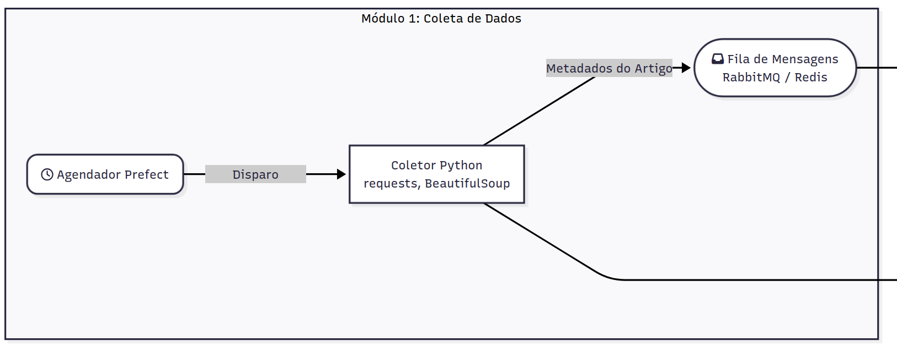
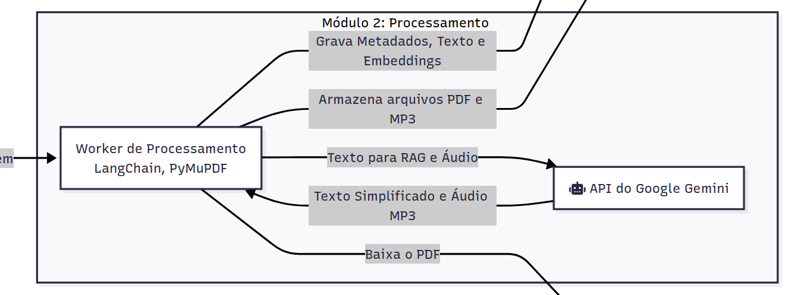
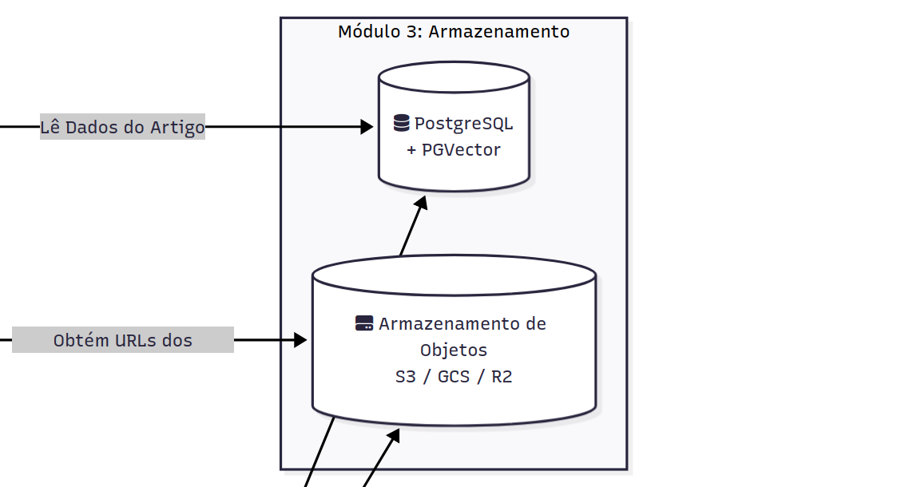
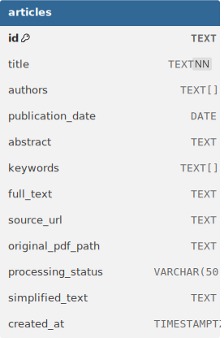
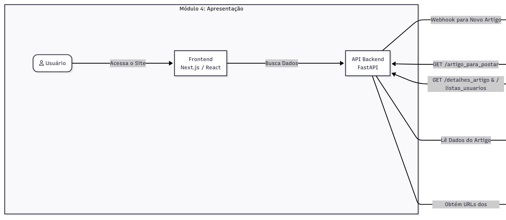
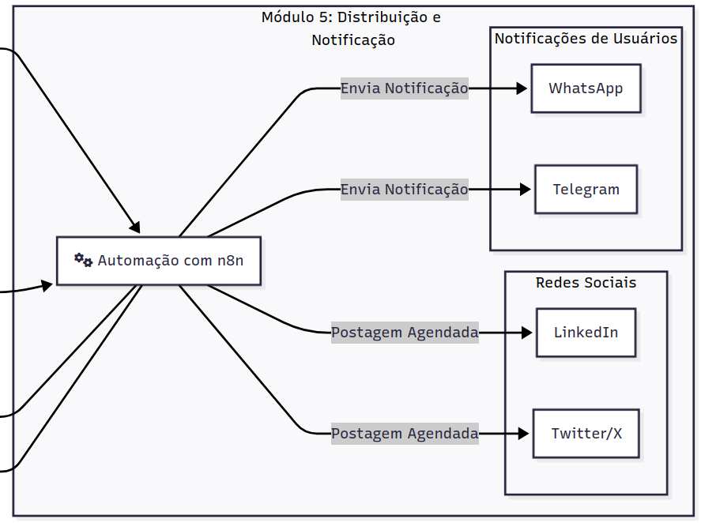

# Arquitetura e Pipelines

O **SciNewsAI** coleta artigos científicos semanais de bases públicas, usa RAG + LLM para gerar versões em linguagem acessível, transforma em podcast, armazena dados e alimenta website, redes sociais e notificações via n8n (LinkedIn, Twitter/X, WhatsApp, Telegram). Este documento detalha componentes, fluxo de dados, modelos, armazenamento, integrações, segurança, monitoramento e plano de implantação.

## Visão Geral da Arquitetura

A arquitetura será orientada a eventos e desacoplada, com o objetivo de promover a manutenção, escalabilidade e a substituição de componentes no futuro.

  
<strong>Figura 1:</strong> Diagrama da Arquitetura. <em>Fonte: Bruno Martins, 2025</em>

  <a href="https://www.mermaidchart.com/d/6aaa3be8-6ad1-4831-99fb-5543e290c0ce" target="_blank">Link do Diagrama</a>

---

### **Módulo 1: Coleta e Enriquecimento de Dados**

> Responsável pela busca de novos artigos, enriquecimento de metadados com métricas de impacto e persistência estruturada.

**Processo:**

1.  **Execução do Pipeline:** O script principal (`main.py`) é acionado (manualmente ou via agendador).
2.  **Busca Primária (Arxiv):** Utiliza a API do Arxiv para identificar papers publicados nos últimos 7 dias nas categorias de Inteligência Artificial (cs.AI, cs.LG, cs.CL).
3.  **Enriquecimento de Metadados (Semantic Scholar):**
    * Para cada paper encontrado, o sistema consulta a API do *Semantic Scholar*.
    * Recupera dados profundos: contagem de citações do paper, H-Index dos autores e histórico de publicações.
4.  **Cálculo de Relevância (Scoring):**
    * Aplica a fórmula logarítmica (detalhada na seção de métricas) para gerar o `relevance_score`.
    * Filtra e ordena os artigos priorizando o equilíbrio entre novidade e autoridade.
5.  **Persistência e Download:**
    * Salva os metadados tratados no banco de dados **PostgreSQL**.
    * Realiza o download automático do PDF para a pasta local `articles_pdf/` para processamento futuro.

**Tecnologias utilizadas:**

* **Python 3.12+**: Linguagem base.
* **Feedparser**: Consumo do feed RSS/Atom do Arxiv.
* **Requests & Tenacity**: Comunicação HTTP resiliente com a API do Semantic Scholar (com retry automático).
* **SQLAlchemy**: ORM para gerenciamento e modelagem do banco de dados PostgreSQL.

---

### **Módulo 2: Processamento e Enriquecimento (ML/AI Core)**

> Transforma o artigo científico bruto (texto técnico) em um resumo acessível utilizando RAG (Retrieval-Augmented Generation).

**Processo:**

1.  **Monitoramento**: O serviço de processamento consulta o banco de dados em busca de artigos recém-inseridos que ainda não possuem resumo (`summary IS NULL`).
2.  **Extração**: Carrega o arquivo PDF salvo localmente (ou via URL) e extrai o texto bruto.
3.  **Chunking & Embedding**: 
    - O texto é dividido em pedaços (chunks) semanticamente coerentes.
    - Cada chunk é convertido em vetor e, opcionalmente, indexado (em memória ou no PGVector) para busca semântica.
4.  **Geração via RAG**: 
    - O sistema formula um prompt para o LLM.
    - Recupera as partes mais relevantes do artigo para dar contexto.
    - O LLM gera uma explicação simplificada e didática do paper.
5.  **Atualização**:
    - O resumo gerado é salvo de volta no registro do artigo no PostgreSQL.

**Tecnologias utilizadas:**

- **LangChain**: Orquestração do fluxo de IA.
- **PyMuPDF / PDFPlumber**: Extração de texto.
- **Sentence-Transformers**: Geração de embeddings locais.
- **OpenAI API (GPT)**: Modelo de linguagem para geração do resumo.

---

### **Módulo 3: Armazenamento (Data Persistence)**

> Centraliza os dados brutos, metadados enriquecidos e vetores para busca semântica.

**Tecnologias utilizadas:**

- **SGBD**: PostgreSQL.

  
<strong>Figura 2:</strong> Tabela SQL de Artigos. <em>Fonte: Gustavo Melo, 2025</em>

---

### **Módulo 4: Apresentação (Frontend & API)**

> Expõe os artigos processados para a web através de um blog.

**Processo:**

1.  O Backend expõe endpoints.
2.  O Frontend consome esses endpoints para renderizar as páginas do blog.
3.  Cada página de artigo exibirá o título, o abstract original e o texto simplificado.

**Tecnologias utilizadas:**

- Backend: FastAPI.
- Frontend: ReactJS.

---

### **Módulo 5: Distribuição e Notificação (Automação)**

> Divulga o conteúdo e notifica usuários interessados.

**Workflow de Divulgação em Redes Sociais (Agendado):**

1. Agendado para rodar algumas vezes por dia (ex: a cada 4 horas).
2. Faz uma chamada HTTP para a API FastAPI.
3. Pega um dos artigos da lista.
4. Usa os nós (nodes) do n8n para Twitter e LinkedIn para formatar e postar uma mensagem com o título do artigo e um link para a página do blog.

**Workflow de Notificações para Usuários (Orientado a Eventos):**

1.  A API envia uma requisição para uma URL de webhook do n8n.
2.  O workflow recebe o ID do artigo.
3.  Faz uma chamada à API para obter os detalhes do artigo.
4.  Para cada tag de tópico, faz outra chamada à API para obter a lista de usuários inscritos naquele tópico.
5.  Itera sobre a lista de usuários e usa os nós de Telegram e WhatsApp para enviar uma mensagem personalizada com o título e o link do novo artigo.

**Tecnologias utilizadas:**

- n8n

## Histórico de Versões

| Versão | Data | Descrição | Autores | Revisores |
| --- | --- | --- | --- | --- |
| `1.0` | 16/10/2025 | Criação do documento de arquitetura | [Bruno Martins](https://github.com/brunomartins03) |  |
| `1.1` | 19/10/2025 | Adicionada imagem de tabela SQL do banco | [Gustavo Melo](https://github.com/gusrberto) |  |
| `1.2` | 25/10/2025 | Adicionada diagramas dos módulos | [Gustavo Melo](https://github.com/gusrberto) |  |
| `1.3` | 10/12/2025 | Refatoração da arquitetura | [Gustavo Melo](https://github.com/gusrberto) |  |