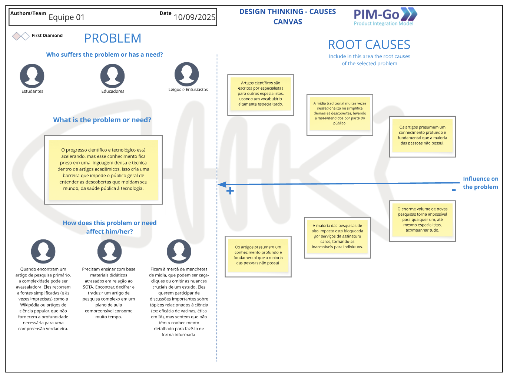
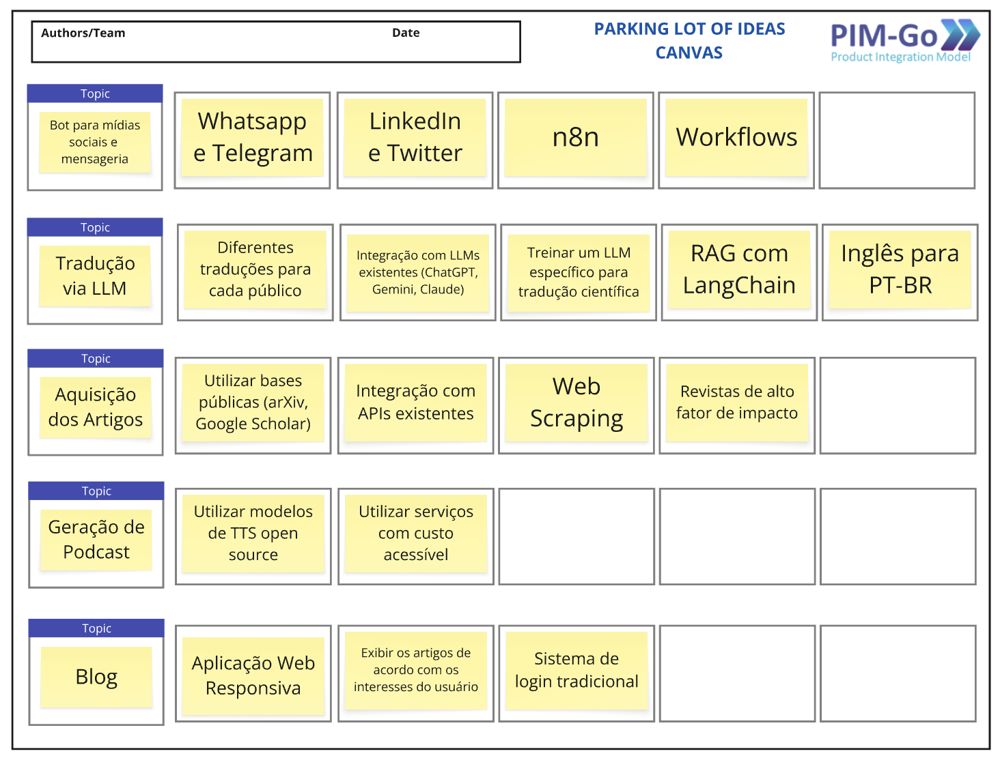
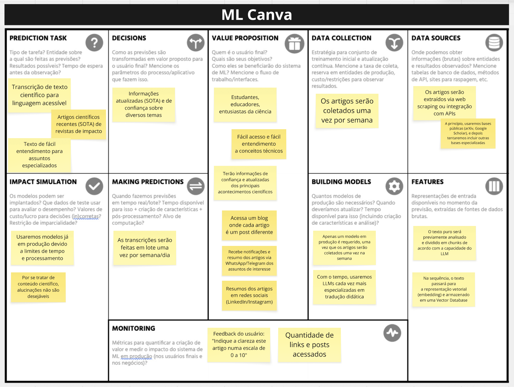

# Design Thinking

## Artefatos

## 1. Design Thinking - Causas Canvas

  
<strong>Figura 1:</strong> Design Thinking - Causas. <em>Fonte: Bruno Martins, 2025</em>

## 2. Design Thinking - Ideias Canvas

  
<strong>Figura 2:</strong> Design Thinking - Ideias. <em>Fonte: Bruno Martins, 2025</em>

## 3. Design Thinking - Filtro de Ideias

  
<strong>Figura 3:</strong> Design Thinking - Filtro de Ideias. <em>Fonte: Bruno Martins, 2025</em>

## 4. Design Thinking - Parking Lot of Ideas

  
<strong>Figura 4:</strong> Design Thinking - Parkint Lot of Ideas. <em>Fonte: Bruno Martins, 2025</em>

## 5. Machine Learning Canvas

  
<strong>Figura 5:</strong> Design Thinking - Machine Learning Canvas. <em>Fonte: Bruno Martins, 2025</em>

## Histórico de Versões

| Versão | Data | Descrição | Autores | Revisores |
| --- | --- | --- | --- | --- |
| `1.0` | 17/10/2025 | Criação do documento e adição dos canvas de design thinking | [Bruno Martins](https://github.com/brunomartins03) |  |
| `1.1` | 19/10/2025 | Adição do Machine Learning Canvas | [Bruno Martins](https://github.com/brunomartins03) |  |